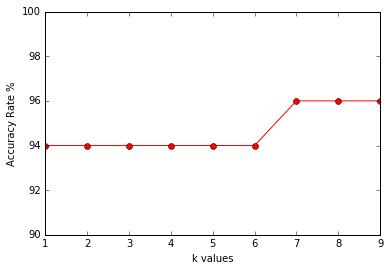
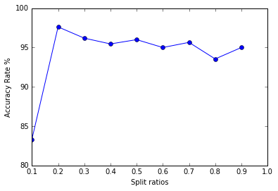

================
Peter Lin


September 11, 2017


```python
import sys
print (sys.version)

%matplotlib inline
```

    3.5.2 |Anaconda 4.1.1 (64-bit)| (default, Jul  5 2016, 11:41:13) [MSC v.1900 64 bit (AMD64)]


What is kNN?

kNN means k-Nearest Neighbours. I think of it as a group of people being divided into categories. 
Imagine a case that you are a military officer trying to recruit a group of young men to participate in the top secret mutant X project as test subjects. You want to divide the men into two groups: those who are fit for the project and who are unfit for the project. Based on several key features: DNA, fitness level, personality score, intelligence, education, height and weight , you can label them sa fit or unfit. With kNN, you can let the algorithm predict whether a young man is fit or unfit for the project when you provide training data for the algorithm. 

I will practice using kNN on the iris dataset downloaded from Dr. Brownlee's blogpost http://machinelearningmastery.com/tutorial-to-implement-k-nearest-neighbors-in-python-from-scratch/  to demonstrate this concept.


```python
# handle the data
import csv
```

Dr. Brownlee's code was written in Python 2.7. I will adjust the codes to use them in Python 3.5.


```python
with open('iris.data', newline='') as csvfile: # removed the parameter 'rb'
    iris_data = csv.reader(csvfile)
    for row in iris_data:
        print(', '.join(row))
        
# from stackoverflow 
# https://stackoverflow.com/questions/8515053/csv-error-iterator-should-return-strings-not-bytes
# 'rb' had this error when running an old python script developped with Python 2.7
# When updating to 3.5, I had to remove all 'rb' parameters from open calls in order to fix this csv reading error.       
```

    5.1, 3.5, 1.4, 0.2, Iris-setosa
    4.9, 3.0, 1.4, 0.2, Iris-setosa
    4.7, 3.2, 1.3, 0.2, Iris-setosa
    4.6, 3.1, 1.5, 0.2, Iris-setosa
    ...
    6.5, 3.0, 5.2, 2.0, Iris-virginica
    6.2, 3.4, 5.4, 2.3, Iris-virginica
    5.9, 3.0, 5.1, 1.8, Iris-virginica
    


Right now, the dataset is in one big mess.

Next, Dr. Brownlee splited the data into a training dataset and a test dataset. The training dataset is to train kNN to make predictions. We can save the test dataset to see how accurate the kNN is in classification.

Steps Dr. Brownlee outlined to split the dataset.
1. convert the flower measures that were loaded as strings into numbers so that the numbers can be evaluated
2. randomly put the rows into training and test sets. Dr. Brownlee used 67/33 ratio for train/test.


```python
import random
```


```python
# Dr. Brownlee defined a function called loadDataset that loads the csv and splits it randomly
# into train and test using a specified split ratio
def loadDataset(filename, split, trainingSet=[], testSet=[]):
    with open(filename) as csvfile: # removed the parameter 'rb' for python 3.5
        iris_data = csv.reader(csvfile)
        dataset = list(iris_data)
        for x in range(len(dataset)-1): # many rows
            for y in range(4): # four columns
                dataset[x][y]= float(dataset[x][y])
            if random.random() < split: # randomize into training set
                trainingSet.append(dataset[x])
            else: # randomize into test set
                testSet.append(dataset[x])
```


```python
# breaking down and making sense of the loadDataset function
disected_train_set = []
disected_test_set = []
with open('iris.data') as csvfile: # removed the parameter 'rb' for python 3.5
        iris_data = csv.reader(csvfile)
        dataset = list(iris_data)
        for x in range(3-1): # just 10 rows
            for y in range(4): # four columns
                dataset[x][y]= float(dataset[x][y])
                print(dataset[x][y])
            if random.random() < 0.66: # randomize into training set
                disected_train_set.append(dataset[x])
                print(dataset[x], 'added to training set')
            else: # randomize into test set
                disected_test_set.append(dataset[x])
                print(dataset[x], 'added to test set')
```

    5.1
    3.5
    1.4
    0.2
    [5.1, 3.5, 1.4, 0.2, 'Iris-setosa'] added to training set
    4.9
    3.0
    1.4
    0.2
    [4.9, 3.0, 1.4, 0.2, 'Iris-setosa'] added to training set


```python
with open('iris.data') as csvfile: # removed the parameter 'rb' for python 3.5
        iris_data = csv.reader(csvfile)
        dataset = list(iris_data)
        for x in range(3-1): # just 10 rows
            for y in range(4): # four columns
                print(dataset[x][y])
```

    5.1
    3.5
    1.4
    0.2
    4.9
    3.0
    1.4
    0.2


```python
# now we can use the function that Dr. Brownlee wrote to load and split the csv
iris_trainingSet=[]
iris_testSet=[]
split_ratio = 0.66
random.seed(151) # seeding to make this script reproducible
loadDataset('iris.data', split_ratio, iris_trainingSet, iris_testSet)
print('number of data points in training set: ' + repr(len(iris_trainingSet)))
print('number of data points in test set: ' + repr(len(iris_testSet)))

# repr() --> Return a string containing a printable representation of an object.
```

    number of data points in training set: 95
    number of data points in test set: 55


```python
print(iris_trainingSet[0]) # sneak peak at the training set

```

    [4.6, 3.1, 1.5, 0.2, 'Iris-setosa']


Dr. Brownlee pointed out that we needed to calculate how different or similar the data points are among others before we can let kNN make predictions.

Since that all four flower metrics are numeric and have the same units, we can think of each row as a vector in a 4D space. If a vector is close to the others then they must be similar. We can calculate the distance among vectors using euclidean distance. Dr. Brownlee demonstrated how to write a euclidean distance function.

euclidean distance refresher: https://en.wikipedia.org/wiki/Euclidean_distance


```python
import math
```


```python
def euclideanDistance(vector1, vector2, length):
    distance = 0 # start by assuming that the two vectors are identical 
    for x in range(length):
        distance += pow(vector1[x] - vector2[x], 2)
    return math.sqrt(distance)

#reminder:
# += adds another value with the variable's value and assigns the new value to the variable.
# >>> x = 3
# >>> x += 2
# >>> print x
# 5
```


```python
# test out the euclideanDistance function
# modify the samples provided by Dr. Brownlee a little bit then run the test
sample_data1 = [1, 1, 1, 1, 'a']
sample_data2 = [4, 4, 4, 4, 'b']
sample_distance = euclideanDistance(sample_data1, sample_data2, 4)
print('Distance of the 2 sample data vectors: ' + repr(sample_distance))
```

    Distance of the 2 sample data vectors: 6.0


Next step is to calculate the distance from a given vector to other vectors nearby. For example, for a given vector A, I want to find the distance of A with its three closes neighbours. I can also find the distance of A with its four, five and six closes neighbours. 

Why do we need to know how close is a given vector to its neighbours? Remember: the closer a vector is to some particular neighbours, we can conclude that the more simlar this vector is to those neighbours. We can use this relative distance to make classifications.

In the mutant x example, the closer a young man's data vector is to other fit candidates, the more likely that he is also a fit candidate.

In Dr. Brownlee's iris example, the closer a particular flower's data vector is to other flower data vectors, the more likely that they are the same type of flowers.

I will use Dr. Brownlee's getNeighbours function as an example.


```python
import operator
def getNeighbours(trainingSet, testdatavector, k):
    data_distances = []
    length_of_vector_element_tested = len(testdatavector)-1 
    # the last element is label= can't calculate that
    for x in range(len(trainingSet)):
        dist = euclideanDistance(testdatavector, trainingSet[x], length_of_vector_element_tested)
        data_distances.append((trainingSet[x], dist))
    data_distances.sort(key=operator.itemgetter(1))
    neighbours = []
    for x in range(k):
        neighbours.append(data_distances[x][0])
    return neighbours

# .sort = sorting 
# http://pythoncentral.io/how-to-sort-a-list-tuple-or-object-with-sorted-in-python/
```


```python
# test out the getNeighbours function
sample_trainingSet = [[2, 2, 2, 2, 'a'],
                      [4, 4, 4, 4, 'b'],
                      [1, 1, 1, 1, 'c']]
sample_test_data_vector = [10, 10, 10, 10]
k = 1
neighbours = getNeighbours(sample_trainingSet, sample_test_data_vector, 1)
print(neighbours) # print one data vector in the sample training set that is the closest
# to the sampe_test_data_vector
```

    [[4, 4, 4, 4, 'b']]


Now we can determine which vectors are close together and which are not. What about the voting part? We can start making predictions by having neighbour vectors to vote. If I have a new data vector, I can ask the neighbouring vectors to vote and decide what type iris it migh be.

Dr. Brownlee uses the getResponse function to demonstrate this voting process.


```python
import operator
def getResponse(neighbours):
    classVotes = {} # create an empty tuple
    for x in range(len(neighbours)):
        response = neighbours[x][-1] # get the label 
        # in the iris data case: the labels are "Iris-virginica" etc.
        if response in classVotes:
            classVotes[response] += 1
        else:
            classVotes[response] =1
    sortedVotes = sorted(classVotes.items(), # instead of .iteritems in Python 2.x
                         key = operator.itemgetter(1),
                         reverse=True)
    return sortedVotes[0][0]

# .iteritems() in Python 2.x
# Using .iteritems() to iterate over key, value in Python dictionary
# https://stackoverflow.com/questions/30223099/using-iteritems-to-iterate-over-key-value-in-python-dictionary
# Now it is .items() in Python 3.x
# https://stackoverflow.com/questions/13998492/iteritems-in-python

# operator.itemgetter(items) 
# Return a callable object that fetches item from its operand using the operand’s __getitem__() method. 
# If multiple items are specified, returns a tuple of lookup values. 
# https://docs.python.org/2/library/operator.html

```


```python
# dissecting getNeighbour function

sample_neighbours = [[2, 2, 2, 2, 'Q'],
                     [5, 5, 5, 5, 'B'],
                     [1, 1, 1, 1, 'Q']]

classVotes = {} # create an empty tuple
for x in range(len(sample_neighbours)):
    response = sample_neighbours[x][-1]
    print(response) # print only the labels of each vectors
```

    Q
    B
    Q


```python
# dissecting getNeighbour function continued

classVotes = {} # create an empty tuple
for x in range(len(sample_neighbours)):
    response = sample_neighbours[x][-1]
    if response in classVotes:
        classVotes[response] += 1
    else:
        classVotes[response] =1
sortedVotes = sorted(classVotes.items(), # instead of .iteritems in Python 2.x
                         key = operator.itemgetter(1),
                         reverse=True) # descending order highest vote to lowest vote
print(sortedVotes)
# two votes for Q label
# one vote for B label
print(sortedVotes[0])
# print item[0] which is the highest vote
print(sortedVotes[0][0])
# print only the label of item[0], which is the highest vote
```

    [('Q', 2), ('B', 1)]
    ('Q', 2)
    Q


```python
# test the getResponse function

sample_neighbours = [[2, 2, 2, 2, 'Q'],
                     [5, 5, 5, 5, 'B'],
                     [1, 1, 1, 1, 'Q']]
sample_response = getResponse(sample_neighbours)
print(sample_response)
```

    Q


we have most of the key pieces of a kNN algorithm constructed. An important component we should include is accuracy. We should always ask ourselves: how accurate is our algorithm?

We need to have a function to evaluate the accruracy of our kNN algorithm. Let's use Dr. Brownlee's example.


```python
def getAccuracy(testSet, predictions):
    correct = 0 # counting how many correct predictions starting from 0
    for x in range(len(testSet)):
        if testSet[x][-1] == predictions[x]: ## instead of 'is' in python 2.x
            correct += 1 # # counting how many correct predictions
    return (correct/float(len(testSet)) * 100.0)
```


```python
# test the getAccuracy function

sample_neighbours = [[2, 2, 2, 2, 'Q'],
                     [5, 5, 5, 5, 'B'],
                     [1, 1, 1, 1, 'Q']]
sample_prediction = ['Q', 'Q', 'Q']
sample_accuracy = getAccuracy(sample_neighbours, sample_prediction)
print(sample_accuracy)
# 2/3 correct
```

    66.66666666666666


Tying all components together using a object-oriented approach! I will construct a kNN algorithm for iris data using Dr. Brownlee's example.


```python
import csv
import random
import math
import operator


def loadDataset(filename, split, trainingSet=[], testSet=[]):
    with open(filename) as csvfile: # removed the parameter 'rb' for python 3.5
        iris_data = csv.reader(csvfile)
        dataset = list(iris_data)
        random.seed(1042)
        for x in range(len(dataset)-1): # many rows
            for y in range(4): # four columns
                dataset[x][y]= float(dataset[x][y])
            if random.random() < split: # randomize into training set
                trainingSet.append(dataset[x])
            else: # randomize into test set
                testSet.append(dataset[x])
                

def euclideanDistance(vector1, vector2, length):
    distance = 0 # start by assuming that the two vectors are identical 
    for x in range(length):
        distance += pow(vector1[x] - vector2[x], 2)
    return math.sqrt(distance)


def getNeighbours(trainingSet, testdatavector, k):
    data_distances = []
    length_of_vector_element_tested = len(testdatavector)-1 
    # the last element is label= can't calculate that
    for x in range(len(trainingSet)):
        dist = euclideanDistance(testdatavector, trainingSet[x], length_of_vector_element_tested)
        data_distances.append((trainingSet[x], dist))
    data_distances.sort(key=operator.itemgetter(1))
    neighbours = []
    for x in range(k):
        neighbours.append(data_distances[x][0])
    return neighbours


def getResponse(neighbours):
    classVotes = {} # create an empty tuple
    for x in range(len(neighbours)):
        response = neighbours[x][-1] # get the label 
        # in the iris data case: the labels are "Iris-virginica" etc.
        if response in classVotes:
            classVotes[response] += 1
        else:
            classVotes[response] =1
    sortedVotes = sorted(classVotes.items(), # instead of .iteritems in Python 2.x
                         key = operator.itemgetter(1),
                         reverse=True)
    return sortedVotes[0][0]


def getAccuracy(testSet, predictions):
    correct = 0 # counting how many correct predictions starting from 0
    for x in range(len(testSet)):
        if testSet[x][-1] == predictions[x]:
            correct += 1 # # counting how many correct predictions
    return (correct/float(len(testSet)) * 100.0)


def iris_kNN(k, split_ratio):
    # prepare data 
    iris_trainingSet = []
    iris_testSet = []
    loadDataset('iris.data', split_ratio, iris_trainingSet, iris_testSet)
    print('number of data points in training set: ' + repr(len(iris_trainingSet)))
    print('number of data points in test set: ' + repr(len(iris_testSet)))
    # generate predictions
    iris_predictions = []
    for x in range(len(iris_testSet)):
        iris_neighbours = getNeighbours(iris_trainingSet, iris_testSet[x], k)
        iris_result = getResponse(iris_neighbours)
        iris_predictions.append(iris_result)
        print('>> predicted=' + repr(iris_result) + ', actual =' + repr(iris_testSet[x][-1]))
    iris_accuracy = getAccuracy(iris_testSet, iris_predictions)
    print('Accuracy: ' + repr(iris_accuracy) + '%')

# dissecting the getAccuracy function in kNN
iris_trainingSet = []
iris_testSet = []
split_ratio = 0.67
loadDataset('iris.data', split_ratio, iris_trainingSet, iris_testSet)
print('number of data points in training set: ' + repr(len(iris_trainingSet)))
print('number of data points in test set: ' + repr(len(iris_testSet)))
# generate predictions
iris_predictions = []
for x in range(len(iris_testSet)):
    iris_neighbours = getNeighbours(iris_trainingSet, iris_testSet[x], k)
    iris_result = getResponse(iris_neighbours)
    iris_predictions.append(iris_result)
print(len(iris_testSet))
print(len(iris_predictions))
correct = 0
for x in range(len(iris_testSet)):
    if iris_testSet[x][-1] == iris_predictions[x]: ###### cannot use 'is' here
        print(True) # # counting how many correct predictions
    else:
        print(False)
```

    number of data points in training set: 100
    number of data points in test set: 50
    50
    50
    True
    True
    ...
    True
    True
    True
    True
    False
    True
    True
    True
    True
    False
    True
    True
    True
    False
    True
    True
    True
    True
    True


```python
# test k = 1
iris_kNN(1, 0.80)
# I don't get k = 2 because I have don't have a tie-breaker rule in my kNN algorithm 
```

    number of data points in training set: 119
    number of data points in test set: 31
    >> predicted='Iris-setosa', actual ='Iris-setosa'
    >> predicted='Iris-setosa', actual ='Iris-setosa'
    >> predicted='Iris-setosa', actual ='Iris-setosa'
    >> predicted='Iris-setosa', actual ='Iris-setosa'
    >> predicted='Iris-setosa', actual ='Iris-setosa'
    ...
    >> predicted='Iris-virginica', actual ='Iris-versicolor'
    >> predicted='Iris-versicolor', actual ='Iris-versicolor'
    >> predicted='Iris-versicolor', actual ='Iris-versicolor'
    >> predicted='Iris-virginica', actual ='Iris-versicolor'
    >> predicted='Iris-versicolor', actual ='Iris-versicolor'
    >> predicted='Iris-virginica', actual ='Iris-virginica'
    >> predicted='Iris-virginica', actual ='Iris-virginica'
    >> predicted='Iris-virginica', actual ='Iris-virginica'
    >> predicted='Iris-virginica', actual ='Iris-virginica'
    >> predicted='Iris-virginica', actual ='Iris-virginica'
    >> predicted='Iris-virginica', actual ='Iris-virginica'
    >> predicted='Iris-virginica', actual ='Iris-virginica'
    Accuracy: 93.54838709677419%


```python
iris_kNN(3, 0.4)
```

    number of data points in training set: 62
    number of data points in test set: 88
    >> predicted='Iris-setosa', actual ='Iris-setosa'
    >> predicted='Iris-setosa', actual ='Iris-setosa'
    >> predicted='Iris-setosa', actual ='Iris-setosa'
    >> predicted='Iris-setosa', actual ='Iris-setosa'
    >> predicted='Iris-setosa', actual ='Iris-setosa'
    ...
    Accuracy: 96.5909090909091%


```python
# using matplotlib to demonstrate the difference in k and the difference in splitting
import matplotlib.pyplot as plt
import numpy as np


def iris_kNN_for_different_k():
    # prepare data 
    range_of_k = list(range(1, 10))
    range_of_ratio = [0.1, 0.2, 0.3, 0.4, 0.5, 0.6, 0.7, 0.8, 0.9]
    iris_error_list_k = []
    iris_error_list_ratio = []
    for item in range_of_k:
            iris_trainingSet = []
            iris_testSet = []
            loadDataset('iris.data', split_ratio, iris_trainingSet, iris_testSet)
            #print('number of data points in training set: ' + repr(len(iris_trainingSet)))
            #print('number of data points in test set: ' + repr(len(iris_testSet)))
            # generate predictions
            iris_predictions = []
            for x in range(len(iris_testSet)):
                iris_neighbours = getNeighbours(iris_trainingSet, iris_testSet[x], item)
                iris_result = getResponse(iris_neighbours)
                iris_predictions.append(iris_result)
                #print('>> predicted=' + repr(iris_result) + ', actual =' + repr(iris_testSet[x][-1]))
            iris_accuracy = getAccuracy(iris_testSet, iris_predictions)
            iris_error_list_k.append(iris_accuracy)
            #print('Accuracy: ' + repr(iris_accuracy) + '%')
    return iris_error_list_k
    

def iris_kNN_for_different_split():
    # prepare data 
    range_of_ratio = [0.1, 0.2, 0.3, 0.4, 0.5, 0.6, 0.7, 0.8, 0.9]
    iris_error_list_ratio = []
    for item in range_of_ratio:
            iris_trainingSet = []
            iris_testSet = []
            loadDataset('iris.data', item, iris_trainingSet, iris_testSet)
            #print('number of data points in training set: ' + repr(len(iris_trainingSet)))
            #print('number of data points in test set: ' + repr(len(iris_testSet)))
            # generate predictions
            iris_predictions = []
            for x in range(len(iris_testSet)):
                iris_neighbours = getNeighbours(iris_trainingSet, iris_testSet[x], k)
                iris_result = getResponse(iris_neighbours)
                iris_predictions.append(iris_result)
                #print('>> predicted=' + repr(iris_result) + ', actual =' + repr(iris_testSet[x][-1]))
            iris_accuracy = getAccuracy(iris_testSet, iris_predictions)
            iris_error_list_ratio.append(iris_accuracy)
            #print('Accuracy: ' + repr(iris_accuracy) + '%')
    return iris_error_list_ratio
    
iris_error_list_k = list(iris_kNN_for_different_k())
print(iris_error_list_k)

iris_error_list_ratio = list(iris_kNN_for_different_split())
print(iris_error_list_ratio)
```

    [94.0, 94.0, 94.0, 94.0, 94.0, 94.0, 96.0, 96.0, 96.0]
    [83.33333333333334, 97.61904761904762, 96.19047619047619, 95.45454545454545, 96.0, 95.0, 95.65217391304348, 93.54838709677419, 95.0]


Now I will plot the accuracy rate against k and ratio.


```python
plt.plot(range_of_k, iris_error_list_k, '-ro')
plt.ylim(90, 100)
plt.ylabel('Accuracy Rate %')
plt.xlabel('k values')
plt.show()
```





```python
plt.plot(range_of_ratio, iris_error_list_ratio, '-bo')
plt.ylim(80, 100)
plt.ylabel('Accuracy Rate %')
plt.xlabel('Split ratios')
plt.show()
```


>


In my kNN attempt, split ratios at 0.1 and 0.2 give a very large variabilty in accuracy. Too few training data points will impact the accuracy.  
