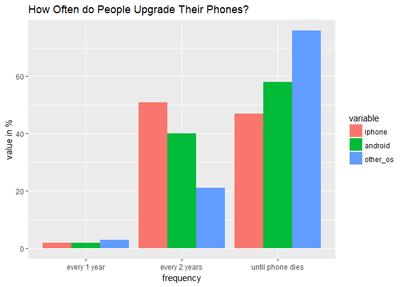

================
Peter Lin
September 29, 2017


Dear ~~bossy~~ wife,

Remember the phone you bought for my 2014 birthday? Unfortunately, the phone, Google Nexus 5 from December 2014, broke down at 2 pm Friday, September 15th, 2017. The Nexus 5 screen went black. I tried to repair the phone, but I realized that it was a motherboard problem. It would cost us an additional $88CDN to order a replacement motherboard and I would have to install it myself. (1, 2) It is time-consuming and not cost-effective since I cannot guarantee a successful repair.

We briefly discussed the possibility of purchasing a new phone, either an iPhone X or an Android Samsung S6, through a 2-year agreement. However, my Fido contract is valid up until September 2018, so I cannot get a discounted phone with a contract renewal at the moment. After careful consideration on our 2017 budget, purchasing a new phone with no term would be a more cost-effective option.

Before comparing both the iPhone X and Samsung S6, I would like to remind you how much we spent on Nexus 5. The breakdown of spending related to Nexus 5 is shown in the table below:

### :money\_with\_wings: How much did Nexus 5 cost us?

|                     | cost    | note                                 |
|---------------------|---------:|--------------------------------------|
| initial cost        | $350.00 | purchased from Vincent, December 2014              |
| case                | $6.71   | eBay, December 2014                                 |
| screen protector    | $38.84  | Invisible Shields - Richmond Centre, December 2014  |
| power button repair | $67.20  | iRevive Mobile Inc., September 2016                 |
| total cost          | $462.75 | $395.55/33 months (since Dec 2014) + repair $67.20/12 months (since Sep 2016) = $17.59 per month |

*I have owned the Nexus 5 for 33 months since December 2014.* *The repair was performed in September 2016 and that was 12 months ago.*

After knowing our baseline cost, we can now compare iPhone X with Samsung S6.

------------------------------------------------------------------------

### :satisfied: iPhone 7 Plus vs Samsung S6 User Experience

I did some research on iPhone and Android user experience. Since iPhone X is not yet released, I have to assume that the latest iPhone, iPhone 7 Plus, is comparable to iPhone X. I also assume those who are satisfied with iPhone 7 Plus would give iPhone X a positive rating. My findings are shown in the table below (3, 4):

|                          | iPhone 7 Plus 32GB         | Samsung S6 32GB          |
|--------------------------|----------------------------|--------------------------|
| Amazon.com User Rating   | 4.0/5 starts (553 reviews) | 3.4/5stars (153 reviews) |
| PhoneArena User Rating   | 9.1/10 (10 reviews)        | 9.0/10 (58 reviews)      |
| PhoneArena Critic Rating | 9.3/10                     | 9.3/10                   |

**Analysis: The reviews are biased and they have questionable accountability.**

------------------------------------------------------------------------

### :clock10: iPhone vs Android: Which one lasts longer?

The Consumer Technology Association publication states that the average lifespan of smartphones is approximately 4.7 years. (5) How does this information compare to our own experience?

<table>
<colgroup>
<col width="18%" />
<col width="22%" />
<col width="59%" />
</colgroup>
<thead>
<tr class="header">
<th></th>
<th align="center">lifespan (years)</th>
<th>status</th>
</tr>
</thead>
<tbody>
<tr class="odd">
<td>benchmark</td>
<td align="center">4.7</td>
<td>--</td>
</tr>
<tr class="even">
<td>Your iPhone 4</td>
<td align="center">7</td>
<td>still functional now but very slow with iOS 8</td>
</tr>
<tr class="odd">
<td>My Nexus 5</td>
<td align="center">2.75</td>
<td>unfunctional: black screen</td>
</tr>
<tr class="even">
<td>Your HTC One M7</td>
<td align="center">3.83</td>
<td>still functional now but back camera produces purple-tinted pictures</td>
</tr>
<tr class="odd">
<td>Dad's iPhone 3GS</td>
<td align="center">3.75</td>
<td>unfunctional: battery expanded and popped the backplate off</td>
</tr>
</tbody>
</table>

Even though the average lifespan of smartphones is 4.7 years, we have had varied lifespan with each model we owned.

Furthermore, some people actually upgrade their phones even before the phones become nonfunctional. How often do iPhone or Android users upgrade their phones? The findings are summarized in the graph below: (5)

<table style="width:100%;">
<colgroup>
<col width="70%" />
<col width="9%" />
<col width="10%" />
<col width="8%" />
</colgroup>
<thead>
<tr class="header">
<th></th>
<th align="right">iPhone</th>
<th align="right">Android</th>
<th align="right">Other</th>
</tr>
</thead>
<tbody>
<tr class="odd">
<td>When a new model is released, usually about every year</td>
<td align="right">2%</td>
<td align="right">2%</td>
<td align="right">3%</td>
</tr>
<tr class="even">
<td>As soon as your cellphone providers allows it, usually every two years</td>
<td align="right">51%</td>
<td align="right">40%</td>
<td align="right">21%</td>
</tr>
<tr class="odd">
<td>Only when it stops working or becomes totally obsolete</td>
<td align="right">47%</td>
<td align="right">58%</td>
<td align="right">76%</td>
</tr>
</tbody>
</table>

``` r
library(ggplot2) # import ggplot2 function for graphing
library(reshape2)

# create data vectors
frequency <- c("every 1 year", "every 2 years", "until phone dies")
iphone <- c(2, 51, 47)
android <- c(2, 40, 58)
other_os <- c(3, 21, 76)

# combine data vectors into data frame
upgrade_frequency_data <- data.frame(frequency, iphone, android, other_os)
upgrade_frequency_data_transposed <- melt(upgrade_frequency_data)
```

    ## Using frequency as id variables

``` r
frequency_table <- table(upgrade_frequency_data_transposed$frequency)
frequency_levels <- names(frequency_table)[order(frequency_table)]
upgrade_frequency_data_transposed$frequency <- factor(upgrade_frequency_data_transposed$frequency, levels = frequency_levels)

# actual graphing
ggplot(upgrade_frequency_data_transposed, aes(x=frequency,
                                              y=value,
                                              fill=variable))+
  geom_bar(stat = "identity", position = "dodge") +
  ggtitle("How Often do People Upgrade Their Phones?") +
  ylab("value in %")
```




**Analysis: Although our experience tells us that iPhones may last a bit longer, iPhone users tend to upgrade more often than Android users. Many users report the slowing down of their old iphones after updating iOS prior to new model launch date. (6) The way we use our phones is closer to the group of using the phone until it dies. We can interpret our experience and upgrade frequency in two ways.**

1.  iPhones have solid build quality which can last longer than Android, but its iOS updates may slow down the phone, forcing users to upgrade.

2.  Android phone qualities vary widely. Cheaper models are likely below the average 4.7-year lifespan while high-end models may last longer. Even so, Android users can upgrade their phones due to lower cost of Android phones. However, the build quality should not be a concern for Samsung S6, because it is considered a 2015 flagship model so it is expected to last longer. (7) Overall, the lifespan of Android phones varies as it depends on the model.

------------------------------------------------------------------------

### Recap: What do we know so far?

**We have conflicting evidence here.** :confused:

:no\_mobile\_phones: User experience: - inconclusive evidence due to biased data sources

:no\_mobile\_phones: Which one lasts longer? iPhone or Android? - inconclusive evidence due to large variance in data

### :pound: Predicting the total cost of a new phone

Since my data sources cannot help us make an informed decision about the purchase, I will try to estimate the cost of owning a new phone.

*All prices include taxes and shipping*

<table style="width:100%;">
<colgroup>
<col width="22%" />
<col width="12%" />
<col width="31%" />
<col width="32%" />
</colgroup>
<thead>
<tr class="header">
<th></th>
<th align="right">baseline</th>
<th align="right">iPhone X 64GB</th>
<th align="right">Samsung S6 32GB</th>
</tr>
</thead>
<tbody>
<tr class="odd">
<td>initial cost</td>
<td align="right">$350</td>
<td align="right"><a href="https://www.apple.com/ca/shop/buy-iphone/iphone-x/5.8-inch-display-64gb-space-grey#00,11,20">Apple store</a> $1477.28</td>
<td align="right"><a href="https://www.amazon.ca/Samsung-Galaxy-Unlocked-Smartphone-Packaging/dp/B00U8KSUIG/ref=sr_1_1?ie=UTF8&amp;qid=1506875261&amp;sr=8-1&amp;keywords=samsung+s6">Amazon.ca</a> $605.34</td>
</tr>
<tr class="even">
<td>case</td>
<td align="right">$6.71</td>
<td align="right"><a href="https://www.amazon.ca/iPhone-Case-Spigen-Liquid-Crystal/dp/B074CMZJMN/ref=sr_1_4?s=electronics&amp;ie=UTF8&amp;qid=1506875584&amp;sr=1-4&amp;keywords=iphone+X+case">Amazon.ca</a> $16.80</td>
<td align="right"><a href="https://www.amazon.ca/PandawellTM-Defender-Protective-Protector-piece-Mint/dp/B00VQJQ24W/ref=sr_1_3?s=electronics&amp;ie=UTF8&amp;qid=1506875317&amp;sr=1-3&amp;keywords=samsung+s6+case">Amazon.ca</a> $11.20</td>
</tr>
<tr class="odd">
<td>screen protector</td>
<td align="right">$38.84</td>
<td align="right"><a href="https://www.amazon.ca/iPhone-Screen-Protector-JETech-Tempered/dp/B07515P7PT/ref=sr_1_1?s=electronics&amp;ie=UTF8&amp;qid=1506875513&amp;sr=1-1&amp;keywords=iphone+X+screen+protector">Amazon.ca</a> $12.32</td>
<td align="right"><a href="https://www.amazon.ca/Leesentec-Protector-Technology-Resistant-Protection/dp/B00WFO2M9Q/ref=sr_1_1?s=electronics&amp;ie=UTF8&amp;qid=1506875399&amp;sr=1-1&amp;keywords=samsung+s6+screen+protector">Amazon.ca</a> $11.20</td>
</tr>
<tr class="even">
<td>power button repair</td>
<td align="right">$67.20</td>
<td align="right"><a href="https://gomobilerepair.ca/device-repair/apple-devices/iphone/iphone-6s-repair/">GoMobile iPhone 6S</a> $78.40</td>
<td align="right"><a href="https://gomobilerepair.ca/device-repair/samsung-phones/samsung-galaxy-s4/">GoMobile Samsung S4</a> $67.20</td>
</tr>
<tr class="odd">
<td>total cost</td>
<td align="right">$462.75</td>
<td align="right">$1584.80</td>
<td align="right">$694.94</td>
</tr>
</tbody>
</table>

**Analysis: Either choice will cost significantly more the my Nexus 5.**

### The Verdict

Since I cannot determine which one is more cost-effective at the moment, we should wait for better deals. Alternatively, we can wait until September 2018 when my Fido contract expires and consider a discounted phone with a 2-year agreement. Until then, I can use your still-functional HTC One M7. Thank you for your full support during my career transition. I could not have done it without you. I am forever grateful.

:wink: With Love,

Your husband

PS. Since I have such an in-depth analysis on this phone purchase and it saves us from unnecessary spending, please do consider increasing my monthly allowance by $15 so I can hang out with my pals. I promise that I will graduate in June 2018 and get a full-time job.

References

1.  LG Nexus 5 North America (LG-D820) Parts \[Internet\]. iFixit. 2017 \[cited 1 October 2017\]. Available from: <https://www.ifixit.com/Store/Parts/LG-Nexus-5-North-America>

2.  LG Google Nexus 5 D820 Motherboard Logic Board 16GB Clean IMEI UNLOCKED | eBay \[Internet\]. eBay. 2017 \[cited 1 October 2017\]. Available from: <http://www.ebay.ca/itm/LG-Google-Nexus-5-D820-Motherboard-Logic-Board-16GB-Clean-IMEI-UNLOCKED-/222625798990?hash=item33d5881b4e:g:dOcAAOSwwN5ZgWzx>

3.  Apple iPhone Unlocked Phone \[Internet\]. Amazon.com. 2017 \[cited 1 October 2017\]. Available from: <https://www.amazon.com/Apple-iPhone-Unlocked-Phone-128/dp/B01LYT95XR/ref=pd_sim_107_8?_encoding=UTF8&refRID=6MQQZA1JR6HM04G4FZ8Q&th=1>

4.  Samsung Galaxy S6 vs Apple iPhone 7 Plus - Phone specs comparison \[Internet\]. Phone Arena. 2017 \[cited 1 October 2017\]. Available from: <https://www.phonearena.com/phones/compare/Samsung-Galaxy-S6,Apple-iPhone-7-Plus/phones/8997%2C9816>

5.  Ely C. The Life Expectancy of Electronics \[Internet\]. Consumer Technology Association. 2014 \[cited 1 October 2017\]. Available from: <https://www.cta.tech/News/Blog/Articles/2014/September/The-Life-Expectancy-of-Electronics.aspx>

6.  Zolfagharifard E. Is Apple deliberately sabotaging old iPhones before a new release? \[Internet\]. Mail Online. 2014 \[cited 1 October 2017\]. Available from: <http://www.dailymail.co.uk/sciencetech/article-2709502/Does-Apple-deliberately-slow-old-models-new-release-Searches-iPhone-slow-spike-ahead-launches.html>

7.  Amadeo R. Samsung’s new flagship smartphones: the Galaxy S6 and Galaxy S6 Edge \[Internet\]. Ars Technica. 2015 \[cited 1 October 2017\]. Available from: <https://arstechnica.com/gadgets/2015/03/samsungs-new-flagship-smartphones-the-galaxy-s6-and-galaxy-s6-edge/>
