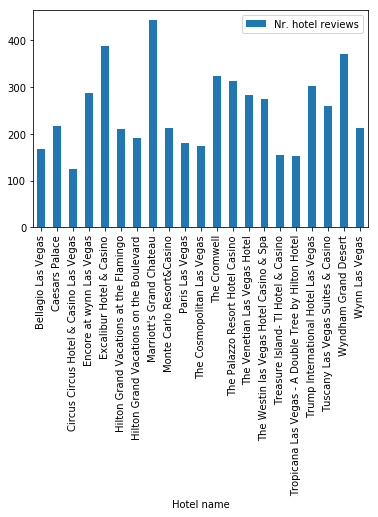
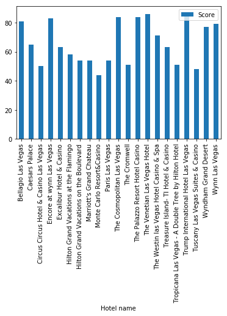
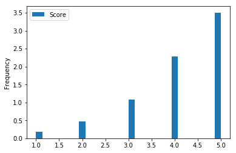
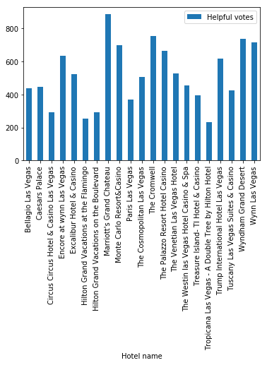
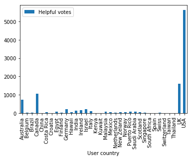
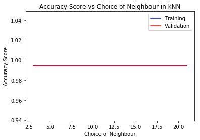
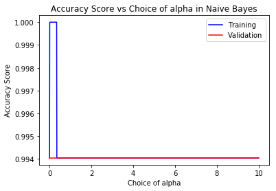
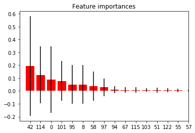

```python
import sys
print(sys.version)
```

    3.5.3 |Anaconda 4.4.0 (x86_64)| (default, Mar  6 2017, 12:15:08)
    [GCC 4.2.1 Compatible Apple LLVM 6.0 (clang-600.0.57)]


```python
# load dependencies
import pandas as pd
import io
import requests
import numpy as np
from scipy import stats
import matplotlib.pyplot as plt
%matplotlib inline

from sklearn.utils import shuffle
from sklearn.neighbors import KNeighborsClassifier
from sklearn.naive_bayes import BernoulliNB
from sklearn.model_selection import train_test_split
from sklearn.ensemble import RandomForestClassifier

from hpsklearn import HyperoptEstimator, any_classifier
from sklearn.datasets import fetch_mldata
from hyperopt import tpe

# reference:
# https://stackoverflow.com/questions/32400867/pandas-read-csv-from-url
```

    WARN: OMP_NUM_THREADS=None =>
    ... If you are using openblas if you are using openblas set OMP_NUM_THREADS=1 or risk subprocess calls hanging indefinitely


### Table of Content
1. [Goal of This Project](#section1)
2. [Golden Rule of Machine Learning](#section2)
3. [Exploratory Data Analysis (EDA)](#section3)
4. [Reflection of EDA](#section4)
5. [More Data Wrangling](#section5)
6. [kNN Classifier](#section6)
7. [NaiveBayes Classifier](#section7)
8. [Random Forest Classifier](#section8)

<a id="section1"></a>
### 1. Goal of This Project

I plan to go to Las Vegas with my undergrad buddies in June 2018. To ensure that we have a good time there, my goal is to find the best features to classify good and bad hotels. I will use my findings help me book a hotel for my trip.

Data Source: [UCI Machine Learning Repository: Las Vegas Strip Data Set](http://archive.ics.uci.edu/ml/datasets/Las+Vegas+Strip)

<a id="section2"></a>
### 2. Follow the "Golden Rule of Machine Learning"

Retrieve the data set from the source and set a side some data instances as a test set. I will only inspect the training data set.


```python
# load the data
url = "http://archive.ics.uci.edu/ml/machine-learning-databases/00397/LasVegasTripAdvisorReviews-Dataset.csv"
raw_dataframe = pd.read_csv(url, delimiter=';')
# reference:
# https://stackoverflow.com/questions/32400867/pandas-read-csv-from-url/41880513#41880513

# shuffle the array (in case it is sorted)
# https://stackoverflow.com/questions/29576430/shuffle-dataframe-rows
np.random.seed(123)
raw_dataframe = shuffle(raw_dataframe)

# split raw data frame into two sets
training_dataframe = raw_dataframe[:336]
test_datafram = raw_dataframe[336:]

# view the first 2 rows of raw data frame
training_dataframe.head(2)
```


<div>
<style>
    .dataframe thead tr:only-child th {
        text-align: right;
    }

    .dataframe thead th {
        text-align: left;
    }

    .dataframe tbody tr th {
        vertical-align: top;
    }
</style>
<table border="1" class="dataframe">
  <thead>
    <tr style="text-align: right;">
      <th></th>
      <th>User country</th>
      <th>Nr. reviews</th>
      <th>Nr. hotel reviews</th>
      <th>Helpful votes</th>
      <th>Score</th>
      <th>Period of stay</th>
      <th>Traveler type</th>
      <th>Pool</th>
      <th>Gym</th>
      <th>Tennis court</th>
      <th>Spa</th>
      <th>Casino</th>
      <th>Free internet</th>
      <th>Hotel name</th>
      <th>Hotel stars</th>
      <th>Nr. rooms</th>
      <th>User continent</th>
      <th>Member years</th>
      <th>Review month</th>
      <th>Review weekday</th>
    </tr>
  </thead>
  <tbody>
    <tr>
      <th>429</th>
      <td>Australia</td>
      <td>43</td>
      <td>38</td>
      <td>29</td>
      <td>5</td>
      <td>Sep-Nov</td>
      <td>Couples</td>
      <td>YES</td>
      <td>YES</td>
      <td>NO</td>
      <td>YES</td>
      <td>YES</td>
      <td>YES</td>
      <td>The Venetian Las Vegas Hotel</td>
      <td>5</td>
      <td>4027</td>
      <td>Oceania</td>
      <td>4</td>
      <td>November</td>
      <td>Saturday</td>
    </tr>
    <tr>
      <th>282</th>
      <td>USA</td>
      <td>12</td>
      <td>5</td>
      <td>1</td>
      <td>5</td>
      <td>Sep-Nov</td>
      <td>Couples</td>
      <td>YES</td>
      <td>YES</td>
      <td>NO</td>
      <td>YES</td>
      <td>YES</td>
      <td>YES</td>
      <td>Encore at wynn Las Vegas</td>
      <td>5</td>
      <td>2034</td>
      <td>North America</td>
      <td>5</td>
      <td>October</td>
      <td>Friday</td>
    </tr>
  </tbody>
</table>
</div>


<a id="section1"></a>
### 3. Exploratory data analysis

I should learn more about the data set then start my feature selection with a deeper understanding of the data set.


```python
training_dataframe.info()

# reference:
# https://github.com/ubcs3/2017-Fall/blob/master/notes-2017-10-06/notes-2017-10-06.ipynb
```

    <class 'pandas.core.frame.DataFrame'>
    Int64Index: 336 entries, 429 to 169
    Data columns (total 20 columns):
    User country         336 non-null object
    Nr. reviews          336 non-null int64
    Nr. hotel reviews    336 non-null int64
    Helpful votes        336 non-null int64
    Score                336 non-null int64
    Period of stay       336 non-null object
    Traveler type        336 non-null object
    Pool                 336 non-null object
    Gym                  336 non-null object
    Tennis court         336 non-null object
    Spa                  336 non-null object
    Casino               336 non-null object
    Free internet        336 non-null object
    Hotel name           336 non-null object
    Hotel stars          336 non-null object
    Nr. rooms            336 non-null int64
    User continent       336 non-null object
    Member years         336 non-null int64
    Review month         336 non-null object
    Review weekday       336 non-null object
    dtypes: int64(6), object(14)
    memory usage: 55.1+ KB


```python
training_dataframe["Hotel name"].value_counts()
```


    The Palazzo Resort Hotel Casino                        19
    The Venetian Las Vegas Hotel                           19
    The Cosmopolitan Las Vegas                             19
    Trump International Hotel Las Vegas                    19
    Bellagio Las Vegas                                     19
    Wyndham Grand Desert                                   18
    Encore at wynn Las Vegas                               18
    The Westin las Vegas Hotel Casino & Spa                18
    Wynn Las Vegas                                         17
    Caesars Palace                                         16
    Excalibur Hotel & Casino                               16
    Treasure Island- TI Hotel & Casino                     16
    Circus Circus Hotel & Casino Las Vegas                 16
    Hilton Grand Vacations at the Flamingo                 15
    Monte Carlo Resort&Casino                              14
    Hilton Grand Vacations on the Boulevard                14
    Paris Las Vegas                                        14
    Tropicana Las Vegas - A Double Tree by Hilton Hotel    13
    Marriott's Grand Chateau                               12
    Tuscany Las Vegas Suites & Casino                      12
    The Cromwell                                           12
    Name: Hotel name, dtype: int64


> Hotels are pretty evenly reviewed by customers.


```python
training_dataframe.groupby("Hotel name").sum().plot.bar(y="Nr. hotel reviews")
```


    <matplotlib.axes._subplots.AxesSubplot at 0x11d98f550>





```python
training_dataframe.groupby("Hotel name").sum().plot.bar(y="Score")
```


    <matplotlib.axes._subplots.AxesSubplot at 0x11d948208>





> Looking at the sum of hotel reviews, I realize that there is a big gap between the highest-rated hotel and the lowest. Looking at the sum of scores however, the gap is not very wide. "Trump International Hotel Las Vegas" seems to be the best rated hotel.


```python
training_dataframe.plot.hist(y="Score", bins=30, normed=True)
plt.show()
```





> Most hotels seem to be in the 5.0 range.


```python
training_dataframe["User country"].value_counts()
```


    USA             162
    UK               45
    Canada           37
    Australia        23
    Ireland          10
    India             7
    Germany           5
    New Zeland        5
    Egypt             3
    Mexico            3
    Malaysia          3
    Netherlands       3
    Brazil            2
    Israel            2
    Norway            2
    Costa Rica        2
    Singapore         2
    Finland           2
    Scotland          2
    Thailand          2
    Saudi Arabia      1
    Kuwait            1
    South Africa      1
    Hawaii            1
    Italy             1
    Switzerland       1
    Croatia           1
    Kenya             1
    Swiss             1
    Puerto Rico       1
    Spain             1
    Taiwan            1
    Belgium           1
    China             1
    Name: User country, dtype: int64


> Most of the reviews are done by US customers. They may or may not reflect Canadian taste.


```python
training_dataframe["Traveler type"].value_counts()
```


    Couples     143
    Families     71
    Friends      62
    Business     44
    Solo         16
    Name: Traveler type, dtype: int64


> Most of the reviews are done by couples. My group is not in this category. We are in the "friends" category.


```python
training_dataframe.groupby("Hotel name").sum().plot.bar(y="Helpful votes")
plt.show()
```





> Reviews of "Marriott's Grand Chateau" received the most helpful votes.


```python
training_dataframe.groupby("User country").sum().plot.bar(y="Helpful votes")
plt.show()
```





> Reviews submitted by US, UK, Canadian, and Australian customers received the most helpful votes.

<a id="section4"></a>
### 4. Reflection after EDA
- Most of the reviews collected in this data set are from US customers and most reviewers are couples. Insight from this data set may not apply to my friends.
- Most hotels are in the 5.0 and 4.0 range. I think that is reassuring. Most customers give good scores.
- Is "Trump International Hotel Las Vegas" really the best?

<a id="section5"></a>
### 5. More Data Wrangling Needed

I realize that most features in this data set are categorical. I need to convert them into dummy variables so I can build a better model.


```python
#redo data wrangling with dummies
raw_dataframe = pd.get_dummies(raw_dataframe)

raw_dataframe.head(2)
```


<div>
<style>
    .dataframe thead tr:only-child th {
        text-align: right;
    }

    .dataframe thead th {
        text-align: left;
    }

    .dataframe tbody tr th {
        vertical-align: top;
    }
</style>
<table border="1" class="dataframe">
  <thead>
    <tr style="text-align: right;">
      <th></th>
      <th>Nr. reviews</th>
      <th>Nr. hotel reviews</th>
      <th>Helpful votes</th>
      <th>Score</th>
      <th>Nr. rooms</th>
      <th>Member years</th>
      <th>User country_Australia</th>
      <th>User country_Belgium</th>
      <th>User country_Brazil</th>
      <th>User country_Canada</th>
      <th>...</th>
      <th>Review month_November</th>
      <th>Review month_October</th>
      <th>Review month_September</th>
      <th>Review weekday_Friday</th>
      <th>Review weekday_Monday</th>
      <th>Review weekday_Saturday</th>
      <th>Review weekday_Sunday</th>
      <th>Review weekday_Thursday</th>
      <th>Review weekday_Tuesday</th>
      <th>Review weekday_Wednesday</th>
    </tr>
  </thead>
  <tbody>
    <tr>
      <th>429</th>
      <td>43</td>
      <td>38</td>
      <td>29</td>
      <td>5</td>
      <td>4027</td>
      <td>4</td>
      <td>1</td>
      <td>0</td>
      <td>0</td>
      <td>0</td>
      <td>...</td>
      <td>1</td>
      <td>0</td>
      <td>0</td>
      <td>0</td>
      <td>0</td>
      <td>1</td>
      <td>0</td>
      <td>0</td>
      <td>0</td>
      <td>0</td>
    </tr>
    <tr>
      <th>282</th>
      <td>12</td>
      <td>5</td>
      <td>1</td>
      <td>5</td>
      <td>2034</td>
      <td>5</td>
      <td>0</td>
      <td>0</td>
      <td>0</td>
      <td>0</td>
      <td>...</td>
      <td>0</td>
      <td>1</td>
      <td>0</td>
      <td>1</td>
      <td>0</td>
      <td>0</td>
      <td>0</td>
      <td>0</td>
      <td>0</td>
      <td>0</td>
    </tr>
  </tbody>
</table>
<p>2 rows × 126 columns</p>
</div>


```python
# convert data frame to numpy array
raw_data = raw_dataframe.values

# split into 2 sets
training_set = raw_data[:336]
test_set = raw_data[336:]

# take out the "score" label
# reference:
# https://stackoverflow.com/questions/8386675/extracting-specific-columns-in-numpy-array
training_label = training_set[:, [43]].flatten()
test_label = test_set[:, [3]].flatten()

X = np.delete(training_set, 3, 1)
Xtest = np.delete(test_set, 3, 1)
```

> Now we are ready for some machine learning.

<a id="section6"></a>
### 6. kNN Classifier

> First, I will try to fit a kNN to establish a baseline for my model and feature selection. It's not a perfect model but it's often hard to beat.


```python
# randomly split into training and validaiton set
Xtrain, Xval, ytrain, yval = train_test_split(X, training_label,
                                                          test_size=0.50,
                                                          random_state=123)
```


```python
neighbour_candidate_list = [3, 5, 7, 9, 11, 13, 15, 17, 19, 21]

kNN_training_score_list = []

kNN_validation_score_list = []

for neighbour_index in neighbour_candidate_list:
    kNN_classifier = KNeighborsClassifier(n_neighbors=neighbour_index, algorithm="brute", p=2)
    kNN_classifier.fit(Xtrain,ytrain)
    kNN_training_score_list.append(kNN_classifier.score(Xtrain, ytrain))
    kNN_validation_score_list.append(kNN_classifier.score(Xval, yval))
```


```python
kNN_validation_score_list
```


    [0.99404761904761907,
     0.99404761904761907,
     0.99404761904761907,
     0.99404761904761907,
     0.99404761904761907,
     0.99404761904761907,
     0.99404761904761907,
     0.99404761904761907,
     0.99404761904761907,
     0.99404761904761907]


```python
# visualize the result
plt.plot(neighbour_candidate_list, kNN_training_score_list, '-', color='blue')
plt.plot(neighbour_candidate_list, kNN_validation_score_list, '-', color='red')
plt.xlabel("Choice of Neighbour")
plt.ylabel("Accuracy Score")
plt.title("Accuracy Score vs Choice of Neighbour in kNN")
plt.legend(["Training","Validation"])
```


    <matplotlib.legend.Legend at 0x11e54c0f0>





> kNN classifiers gives a very high accuracy at any number of neighbour given.

<a id="section7"></a>
### 7. Naive Bayes Classifier

Naive Bayes should be useful in this data set because there are many zeros and ones.


```python
np.random.seed(123)

alpha_candidates = np.arange(0,10,0.01)

naivebayes_training_score_list = list() # creat a list to store error rates at different gamma values
naivebayes_validation_score_list = list()

for alpha_index in alpha_candidates:
    naivebayes_model = BernoulliNB(alpha=alpha_index)
    naivebayes_model.fit(Xtrain, ytrain)
    naivebayes_training_score_list.append(naivebayes_model.score(Xtrain, ytrain))
    naivebayes_validation_score_list.append(naivebayes_model.score(Xval, yval))
```

    /Users/peterlin/anaconda3/lib/python3.5/site-packages/sklearn/naive_bayes.py:801: RuntimeWarning: divide by zero encountered in log
      self.feature_log_prob_ = (np.log(smoothed_fc) -
    /Users/peterlin/anaconda3/lib/python3.5/site-packages/sklearn/naive_bayes.py:820: RuntimeWarning: divide by zero encountered in log
      neg_prob = np.log(1 - np.exp(self.feature_log_prob_))


```python
# visualize the result
plt.plot(alpha_candidates, naivebayes_training_score_list, '-', color='blue')
plt.plot(alpha_candidates, naivebayes_validation_score_list, '-', color='red')
plt.xlabel("Choice of alpha")
plt.ylabel("Accuracy Score")
plt.title("Accuracy Score vs Choice of alpha in Naive Bayes")
plt.legend(["Training","Validation"])
```


    <matplotlib.legend.Legend at 0x11e6991d0>





> Naive Bayes does not seem to give a better result than kNN. I will keep kNN as my baseline.


```python
naivebayes_model.get_params
```


    <bound method BaseEstimator.get_params of BernoulliNB(alpha=9.9900000000000002, binarize=0.0, class_prior=None,
          fit_prior=True)>


<a id="section8"></a>
### 8. Random Forest Classifier

I will try the best out-of-box classifer, Random Forest, and hyperparameter optimizer to figure out what are the best features for this data set.   


```python
np.random.seed(123)

estimator = HyperoptEstimator( classifier=RandomForestClassifier(),  
                            algo=tpe.suggest, trial_timeout=100)

estimator.fit(Xtrain, ytrain)

print( estimator.score( Xval, yval ) )
print( estimator.best_model() )
```

    /Users/peterlin/anaconda3/lib/python3.5/site-packages/sklearn/utils/validation.py:429: DataConversionWarning: Data with input dtype int64 was converted to float64 by the normalize function.
      warnings.warn(msg, _DataConversionWarning)
    /Users/peterlin/anaconda3/lib/python3.5/site-packages/sklearn/utils/validation.py:429: DataConversionWarning: Data with input dtype int64 was converted to float64 by the normalize function.
      warnings.warn(msg, _DataConversionWarning)
    /Users/peterlin/anaconda3/lib/python3.5/site-packages/sklearn/utils/validation.py:429: DataConversionWarning: Data with input dtype int64 was converted to float64 by StandardScaler.
      warnings.warn(msg, _DataConversionWarning)
    /Users/peterlin/anaconda3/lib/python3.5/site-packages/sklearn/utils/validation.py:429: DataConversionWarning: Data with input dtype int64 was converted to float64 by MinMaxScaler.
      warnings.warn(msg, _DataConversionWarning)
    /Users/peterlin/anaconda3/lib/python3.5/site-packages/sklearn/utils/validation.py:429: DataConversionWarning: Data with input dtype int64 was converted to float64 by MinMaxScaler.
      warnings.warn(msg, _DataConversionWarning)
    /Users/peterlin/anaconda3/lib/python3.5/site-packages/sklearn/utils/validation.py:429: DataConversionWarning: Data with input dtype int64 was converted to float64 by StandardScaler.
      warnings.warn(msg, _DataConversionWarning)
    /Users/peterlin/anaconda3/lib/python3.5/site-packages/sklearn/utils/validation.py:429: DataConversionWarning: Data with input dtype int64 was converted to float64 by the normalize function.
      warnings.warn(msg, _DataConversionWarning)
    /Users/peterlin/anaconda3/lib/python3.5/site-packages/sklearn/utils/validation.py:429: DataConversionWarning: Data with input dtype int64 was converted to float64 by StandardScaler.
      warnings.warn(msg, _DataConversionWarning)
    /Users/peterlin/anaconda3/lib/python3.5/site-packages/sklearn/utils/validation.py:429: DataConversionWarning: Data with input dtype int64 was converted to float64 by the normalize function.
      warnings.warn(msg, _DataConversionWarning)


    0.994047619048
    {'learner': RandomForestClassifier(bootstrap=True, class_weight=None, criterion='gini',
                max_depth=None, max_features='auto', max_leaf_nodes=None,
                min_impurity_split=1e-07, min_samples_leaf=1,
                min_samples_split=2, min_weight_fraction_leaf=0.0,
                n_estimators=10, n_jobs=1, oob_score=False, random_state=None,
                verbose=0, warm_start=False), 'ex_preprocs': (), 'preprocs': (Normalizer(copy=True, norm='l1'),)}


    /Users/peterlin/anaconda3/lib/python3.5/site-packages/sklearn/utils/validation.py:429: DataConversionWarning: Data with input dtype int64 was converted to float64 by the normalize function.
      warnings.warn(msg, _DataConversionWarning)
    /Users/peterlin/anaconda3/lib/python3.5/site-packages/sklearn/utils/validation.py:429: DataConversionWarning: Data with input dtype int64 was converted to float64 by the normalize function.
      warnings.warn(msg, _DataConversionWarning)


```python
# refit the model with optimal hyperparameters
ideal_rf_model = RandomForestClassifier(bootstrap=True, class_weight=None, criterion='gini',
            max_depth=None, max_features='auto', max_leaf_nodes=None,
            min_impurity_split=1e-07, min_samples_leaf=1,
            min_samples_split=2, min_weight_fraction_leaf=0.0,
            n_estimators=10, n_jobs=1, oob_score=False, random_state=None,
            verbose=0, warm_start=False)
ideal_rf_model.fit(Xtrain, ytrain)
ideal_rf_model.score(Xval, yval)
```


    0.99404761904761907


> Random forest also ties with kNN. kNN does not provide information for feature selection. I will visualize the features used in this forest model.


```python
# reference:
# http://scikit-learn.org/stable/auto_examples/ensemble/plot_forest_importances.html
feature_importance = ideal_rf_model.feature_importances_

std = np.std([tree.feature_importances_ for tree in ideal_rf_model.estimators_],
             axis=0)

# sort the features by its importance
indices = np.argsort(feature_importance)[::-1]

# Print the feature ranking
print("Feature ranking:")

for feature in range(15):
    print("%d. feature %d (%f)" % (feature + 1, indices[feature], feature_importance[indices[feature]]))

```

    Feature ranking:
    1. feature 42 (0.193413)
    2. feature 114 (0.124644)
    3. feature 0 (0.086228)
    4. feature 101 (0.077973)
    5. feature 95 (0.050602)
    6. feature 8 (0.050299)
    7. feature 58 (0.037725)
    8. feature 97 (0.027950)
    9. feature 94 (0.009461)
    10. feature 67 (0.007438)
    11. feature 115 (0.007273)
    12. feature 103 (0.006174)
    13. feature 51 (0.006017)
    14. feature 122 (0.005091)
    15. feature 55 (0.004456)


```python
# Plot the feature importances of the forest
plt.figure()
plt.title("Feature importances")
plt.bar(range(Xtrain.shape[1]), feature_importance[indices],
       color="r", yerr=std[indices], align="center")
plt.xticks(range(Xtrain.shape[1]), indices)
plt.xlim([-1, 15])
plt.show()
```


```python
raw_dataframe_no_score = raw_dataframe.drop("Score", axis=1)
```


```python
# print and save the key features

key_feature_list = []

for index in [42, 114, 0, 101, 95, 8, 58, 97, 94, 67, 115, 103, 51, 122, 55, 57]:
    print(list(raw_dataframe_no_score)[index])
    key_feature_list.append(list(raw_dataframe_no_score)[index])
```

    User country_Singapore
    Review month_May
    Nr. reviews
    User continent_Asia
    Hotel stars_3
    User country_Canada
    Traveler type_Couples
    Hotel stars_4
    Hotel name_Wynn Las Vegas
    Tennis court_YES
    Review month_November
    User continent_North America
    User country_USA
    Review weekday_Thursday
    Period of stay_Mar-May
    Traveler type_Business


<a id="section9"></a>
### 9. Conclusion

Findings are summarized in the table below:

**Summary of key features:**

| key features                  | applicable to me        | interpretation                                                                                                                                                                                                                                                                                                    |
|-------------------------------|-------------------------|-------------------------------------------------------------------------------------------------------------------------------------------------------------------------------------------------------------------------------------------------------------------------------------------------------------------|
| User country_Singapore        |                         | None of my buddies are Singapore. I am not really sure how this feature is ranked as the most important  how it is relevant to the hotel score.                                                                                                                                                                   |
| Review month_May              | :ballot_box_with_check: | we plan to visit Las Vegas in June but if we can get a good deal on high-score hotels then we can go in May 2018 instead. (of course, it has to be early May before Capstone starts.) One of the best times to visit Las Vegas is from March to May. [ref](https://travel.usnews.com/Las_Vegas_NV/When_To_Visit/) |
| Nr. reviews                   | :ballot_box_with_check: | This feature is fairly intuitive. Number of review is very important. Having more reviews means that the hotel score is more reliable.                                                                                                                                                                            |
| User continent_Asia           |                         | I'm not sure how this feature is relevant but it is not applicable in my use case. My buddies and I are in North America.                                                                                                                                                                                         |
| Hotel stars_3                 | :ballot_box_with_check: | This feature is relevant in my case. My interpretation is that hotel star less than or equal to 3 is associated with a lower hotel score. It is best to avoid them. It is probably negatively correlated with hotel score.                                                                                        |
| User country_Canada           | :ballot_box_with_check: | I will trust the hotel score more when I see more Canadian customers rate it.                                                                                                                                                                                                                                     |
| Traveler type_Couples         |                         | This feature is highlighted in my EDA. It confirms my EDA finding but it is not relevant in my use case.                                                                                                                                                                                                          |
| Hotel stars_4                 | :ballot_box_with_check: | This feature is relevant in my case. My interpretation is that hotel star more than or equal to 4 is associated with a best hotel score. It is best to pay close attention to their promotions                                                                                                                    |
| Hotel name_Wynn Las Vegas     | :ballot_box_with_check: | This feature is highlighted in my EDA. It confirms my EDA finding. I should let my buddies know about this hotel.                                                                                                                                                                                                 |
| Tennis court_YES              |                         | Having a tennis court is probably associated with 4-star or 5-star hotels and these hotels tend to have higher scores. These features are correlated.                                                                                                                                                             |
| Review month_November         | :ballot_box_with_check: | November is usually slower in Las Vegas and it is likely to have good hotel promotions. [ref](https://travel.usnews.com/Las_Vegas_NV/When_To_Visit/)                                                                                                                                                              |
| User continent_North America  | :ballot_box_with_check: | This feature is highlighted in my EDA. It confirms my EDA finding. US and Canadian customers are among the top 4 review contributors. These features are correlates.                                                                                                                                              |
| User country_USA              |                         | This feature is highlighted in my EDA. It confirms my EDA finding. We are Canadians.  :smiley:                                                                                                                                                                                                                    |
| Review weekday_Thursday       | :ballot_box_with_check: | Thursday hotel+flight packages are very good deals.                                                                                                                                                                                                                                                               |
| Period of stay_Mar-May        | :ballot_box_with_check: | One of the best times to visit Las Vegas is from March to May. [ref](https://travel.usnews.com/Las_Vegas_NV/When_To_Visit/)                                                                                                                                                                                       |
| Traveler type_Business        |                         | We are travelling for leisure.                                                                                                                                                                                                                                                                                    |


```python
# Plot the feature importances of the forest in order of importance
plt.figure()
plt.title("Feature importances")
plt.bar(range(Xtrain.shape[1]), feature_importance[indices],
       color="r", yerr=std[indices], align="center")
plt.xticks(range(Xtrain.shape[1]), indices)
plt.xlim([-1, 15])
plt.show()
```





**Feature importance ranking**

We should note that these key features have very high inter-trees variability! Some trees may have these features while many other trees may not use all of these features. If I create more trees, I may decrease the inter-trees variability and the feature importance ranking may change. I suspect that features such as "User country_USA", "User country_Canada" and "User continent_North America" will move up in ranking while "User country_Singapore" will probably drop.

**Feature dependence**

After analyzing and summarizing the key features in one table, I realize that many features are correlated.

1. "User country_USA" and "User country_Canada" are correlated with "User continent_North America". I should probably remove "User continent" altogether because "User country" is sufficient for my use case. The rank-1 feature is only 0.193413. Removing duplicate features or redundant features will remove the number of zeros in the data set. A less-sparse data set should help me to narrow down to the truly important features.

2. "Hotel stars_3" and "Hotel stars_4": These features are also associated. I should combine them into one binary feature by giving 4-star and 5-star a value of 1 and 3-star below a value of 0 to reduce the number of zeros in the data set.

**False positives**

Search and score with validation error can handle dependence and context-specific relevance problems of feature selection. Using validation score as metric, I did identify these dependence issues. However, this approach is prone to false positives. I suspect that features such as "User country_Singapore" and "User continent_Asia" are examples of false positives due to tiny effects.

**Correlation not causality**

I should remind myself that the key features only suggest correlation not causality. I cannot overinterpret my result and tell my buddies that these are the reasons why a hotel gets high scores. In order to prove causality, I will have to design an experiment such as a randomized controlled trial.

**Domain expert input**

As per DSCI 573 lecture notes, Dr. Schmidt suggested that domain expert inputs would often be the key to the true answers. I should probably consult travel blogs and check their Las Vegas recommendations against my own findings.

**Coupon collecting problem**

I started with 19 features and 504 data instances. It is a good ratio there because I have 26 times more data than my features. However, when I convert the categorical variables to dummy variables, I have 126 features versus 504 data instances. Dr. Schmidt recommended that the data instances should be at least 10 times more than the features. Not having enough data for the corresponding number of features, I cannot let my model learn all the possible combinations of my features. The coupon-collecting problem is evident in this analysis.

**Take-home message**

I will share my findings with my buddies but I will warn them that the analysis is definitely far from perfect!


```python
%%bash

pip freeze
```

    alabaster==0.7.10
    anaconda-clean==1.0
    anaconda-client==1.6.3
    anaconda-navigator==1.6.2
    anaconda-project==0.6.0
    appnope==0.1.0
    appscript==1.0.1
    argcomplete==1.0.0
    asn1crypto==0.22.0
    astroid==1.4.9
    astropy==1.3.2
    attrs==16.3.0
    Babel==2.4.0
    backports.shutil-get-terminal-size==1.0.0
    beautifulsoup4==4.6.0
    bitarray==0.8.1
    blaze==0.10.1
    bleach==1.5.0
    bokeh==0.12.5
    boto==2.46.1
    Bottleneck==1.2.1
    bs4==0.0.1
    cffi==1.10.0
    chardet==3.0.3
    chest==0.2.3
    click==6.7
    cloudpickle==0.2.2
    clyent==1.2.2
    colorama==0.3.9
    conda==4.3.25
    conda-build==2.0.2
    configobj==5.0.6
    constantly==15.1.0
    contextlib2==0.5.5
    cryptography==1.8.1
    cssselect==1.0.1
    cycler==0.10.0
    Cython==0.25.2
    cytoolz==0.8.2
    dask==0.14.3
    datashape==0.5.4
    decorator==4.0.11
    dill==0.2.5
    distributed==1.16.3
    docutils==0.13.1
    dynd==0.7.3.dev1
    entrypoints==0.2.2
    et-xmlfile==1.0.1
    fastcache==1.0.2
    filelock==2.0.6
    Flask==0.12.2
    Flask-Cors==3.0.2
    future==0.16.0
    gevent==1.2.1
    gitdb2==2.0.2
    github3.py==1.0.0a4
    GitPython==2.1.5
    graphviz==0.8.1
    greenlet==0.4.12
    h5py==2.7.0
    HeapDict==1.0.0
    -e git+https://github.com/hyperopt/hyperopt-sklearn.git@4b28c67b91c67ecea32bc27d64c15b2635991336#egg=hpsklearn
    html5lib==0.999999999
    hyperopt==0.1
    idna==2.5
    imagesize==0.7.1
    incremental==16.10.1
    ipykernel==4.6.1
    ipython==5.3.0
    ipython-genutils==0.2.0
    ipywidgets==6.0.0
    isort==4.2.5
    itsdangerous==0.24
    jdcal==1.3
    jedi==0.10.2
    Jinja2==2.9.6
    jsonschema==2.6.0
    jupyter==1.0.0
    jupyter-client==5.0.1
    jupyter-console==5.1.0
    jupyter-core==4.3.0
    lazy-object-proxy==1.2.2
    llvmlite==0.18.0
    locket==0.2.0
    lxml==3.7.3
    MarkupSafe==0.23
    matplotlib==2.0.2
    mistune==0.7.4
    mpmath==0.19
    msgpack-python==0.4.8
    multipledispatch==0.4.9
    navigator-updater==0.1.0
    nb-anacondacloud==1.2.0
    nb-conda==2.0.0
    nb-conda-kernels==2.0.0
    nbconvert==5.1.1
    nbformat==4.3.0
    nbpresent==3.0.2
    networkx==1.11
    nltk==3.2.3
    nose==1.3.7
    notebook==5.0.0
    numba==0.33.0
    numexpr==2.6.2
    numpy==1.12.1
    numpydoc==0.6.0
    oauthlib==2.0.1
    odo==0.5.0
    olefile==0.44
    openpyxl==2.4.7
    packaging==16.8
    pandas==0.20.1
    pandocfilters==1.4.1
    parsel==1.1.0
    partd==0.3.8
    pathlib2==2.2.1
    patsy==0.4.1
    pep8==1.7.0
    pexpect==4.2.1
    pickleshare==0.7.4
    Pillow==4.1.1
    pkginfo==1.3.2
    ply==3.10
    prompt-toolkit==1.0.14
    psutil==5.2.2
    ptyprocess==0.5.1
    py==1.4.33
    pyasn1==0.1.9
    pyasn1-modules==0.0.8
    pycosat==0.6.2
    pycparser==2.17
    pycrypto==2.6.1
    pycurl==7.43.0
    PyDispatcher==2.0.5
    pyflakes==1.5.0
    Pygments==2.2.0
    pylint==1.6.4
    pymongo==3.6.0
    pyodbc==4.0.16
    pyOpenSSL==17.0.0
    pyparsing==2.1.4
    pytest==3.0.7
    python-dateutil==2.6.0
    pytz==2017.2
    PyWavelets==0.5.2
    PyYAML==3.12
    pyzmq==16.0.2
    QtAwesome==0.4.4
    qtconsole==4.3.0
    QtPy==1.2.1
    queuelib==1.4.2
    redis==2.10.5
    requests==2.14.2
    requests-oauthlib==0.7.0
    rope-py3k==0.9.4.post1
    scikit-image==0.13.0
    scikit-learn==0.18.1
    scipy==0.19.0
    Scrapy==1.3.0
    seaborn==0.7.1
    service-identity==16.0.0
    simplegeneric==0.8.1
    simplejson==3.11.1
    singledispatch==3.4.0.3
    six==1.10.0
    smmap2==2.0.3
    snowballstemmer==1.2.1
    sockjs-tornado==1.0.3
    sortedcollections==0.5.3
    sortedcontainers==1.5.7
    Sphinx==1.5.6
    spyder==3.1.4
    SQLAlchemy==1.1.9
    statsmodels==0.8.0
    sympy==1.0
    tables==3.3.0
    tabulate==0.7.7
    tblib==1.3.2
    terminado==0.6
    testpath==0.3
    toolz==0.8.2
    tornado==4.5.1
    traitlets==4.3.2
    tweepy==3.5.0
    Twisted==16.6.0
    unicodecsv==0.14.1
    uritemplate==3.0.0
    uritemplate.py==3.0.2
    w3lib==1.16.0
    wcwidth==0.1.7
    webencodings==0.5
    Werkzeug==0.12.2
    widgetsnbextension==2.0.0
    wrapt==1.10.10
    xgboost==0.6
    xlrd==1.0.0
    XlsxWriter==0.9.6
    xlwings==0.10.4
    xlwt==1.2.0
    zict==0.1.2
    zope.interface==4.3.3


```python

```
